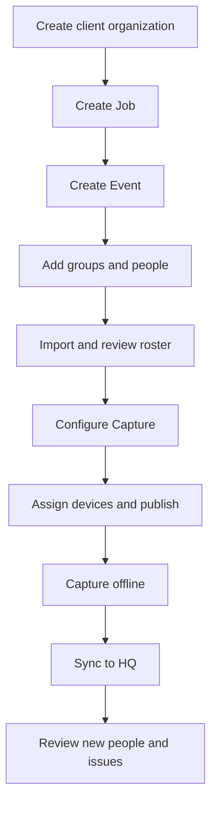

# HQ MVP user flows

This document turns the HQ MVP and architecture decisions into a reviewable first-release experience. It describes the studio staff workflow; the customer-facing gallery and ordering experience is outside this release.

## Primary user

The primary user is a studio owner or staff member preparing and managing volume-photography work. They use HQ from a web browser for planning, roster management, and sync review. Photographers use Pilot Capture at the event, including when offline.

The interface is desktop-first for setup and roster work, with responsive layouts for checking event and sync status on a tablet or phone. Interactive controls should meet the existing VolumePilot touch target baseline where practical. Use labels, icons, and text for state, not color alone.

## Navigation

Keep the first navigation short:

- **Home**: upcoming Events, setup tasks, and sync items needing attention.
- **Work**: Jobs and their Events.
- **Organizations**: client organizations and their configurable unit hierarchy.
- **People**: subjects, memberships, and newly synchronized people awaiting review.
- **Devices**: registered Capture installations, assignments, and health.
- **Settings**: company account, staff, roles, and preferences.

Within an Event, provide a consistent workspace with sections for **Overview**, **Groups & roster**, **Capture setup**, **Devices & sync**, and **Activity**.

## End-to-end workflow

### 1. Create or choose a client organization

A staff member searches the company’s existing client organizations before adding one. Creating an organization asks for a name and optional contact details. Organization units can be added with user-chosen types, such as school, campus, sport, program, division, or team.

Avoid forcing every customer into one predefined hierarchy. The user can create only the levels their workflow needs.

### 2. Create a Job and Event

Create the Job with the client organization, internal reference, and planning notes. Add one or more Events with date/time, site/location, and operational notes. If this is a one-day job, the user can create its Job and Event in one short flow.

An Event workspace displays readiness, the next setup step, and its assigned devices. Group, roster, station, and Capture work remains scoped to the Event.

### 3. Import and review a roster

Use a guided, reversible flow:

1. Choose a CSV file and target Event.
2. Map source columns to suggested subject, group, and membership fields.
3. Preview representative rows and show validation counts.
4. Review blank or invalid fields, repeated source rows, and possible identity matches.
5. Confirm import and retain the original file, checksum, source rows, mapping, and import result.
6. Export a separate normalized roster when needed.

The review step must preserve spelling and original cells. It must not silently merge people based on an exact name, roster number, or filename. The user can accept a suggested match or keep separate records.

### 4. Configure Capture

The Capture setup section presents supported workflow dimensions as clear choices or profiles:

- Portrait or action context
- Single group or multiple groups
- Known rostered subjects allowed
- Partial or unidentified subject entry allowed
- One image or multiple/variable images per subject
- Required subject and group association rules
- Station assignments

The user should see the practical effect of each selection and an at-a-glance setup summary. Common combinations can be saved as reusable profiles later; the initial release should avoid a free-form workflow builder.

### 5. Assign devices and publish

Select registered Capture installations for the Event. Show station identity, last contact, and any current assignment. Publishing creates a new immutable configuration revision and makes it available to assigned installations.

The user sees the revision, publication time, roster counts, and device delivery state. If the Event has already started, HQ warns that changes create a newer revision and do not rewrite existing Capture history.

### 6. Capture while offline

Pilot Capture receives and stores the assigned Event snapshot locally. It can capture and create subjects offline. HQ does not appear in the photographer’s critical capture path.

This step is represented in HQ through device assignment and sync status; HQ is not a live remote control for capture operations.

### 7. Review sync

The Devices & sync section shows each installation, last successful contact, active Event revision, received batches, accepted records, and actionable errors. Each sync item can be traced to its device and Event.

New offline subjects enter a review queue. HQ can show possible duplicates as suggestions, but requires an explicit human decision to link or merge identities. Corrections preserve the original synced record and add an audit entry.

## Screen requirements

| Screen | Primary task | Key content |
|---|---|---|
| Home | Find the next task | Upcoming Events, setup readiness, sync failures, subjects awaiting review |
| Work list | Locate a Job | Client, Job status, next Event date, Event count |
| Job overview | Coordinate booked work | Client, notes, Events, overall progress |
| Event overview | Prepare one operational occurrence | Date/site, groups, roster count, Capture readiness, device assignments |
| Groups & roster | Review Event people | Searchable subjects, memberships, group filters, import state |
| Roster import | Map and safely apply source rows | File/source details, mapping, preview, validation, review, import log |
| Capture setup | Define Capture behavior | Workflow dimensions, selected profile, published revision |
| Devices & sync | Prepare stations and receive results | Installation identity, assignment, revision, last sync, pending batches and errors |
| People review | Resolve new identities | Partial identity details, source device/Event, possible matches, explicit keep/link actions |
| Activity | Understand changes | Actor or device, action, timestamp, affected record, before/after summary where appropriate |

## States and feedback

- Distinguish **draft**, **ready to publish**, **published**, and **in use** configuration states.
- Distinguish **never synced**, **sync pending**, **synced**, and **needs attention** device states.
- Provide visible counts and row-level reasons for roster validation.
- Keep recoverable errors with a clear next action. Never report a full sync as successful if records were rejected without showing them.
- Preserve a searchable activity history for imports, publications, assignments, syncs, and identity corrections.
- Use Navy and neutral surfaces for structure, Royal Blue for primary interaction, and Flight Orange sparingly for forward actions or attention. Follow the VolumePilot brand guide’s contrast and color-use rules.

## Decisions this flow intentionally leaves for implementation design

- Exact web component framework and component library
- Sign-in and email/invitation provider
- Exact role names and per-action permission matrix
- Screen-level field lists for client contacts and organization unit types
- Exact roster import file-size limits and validation rules
- Exact sync API payload and error codes
